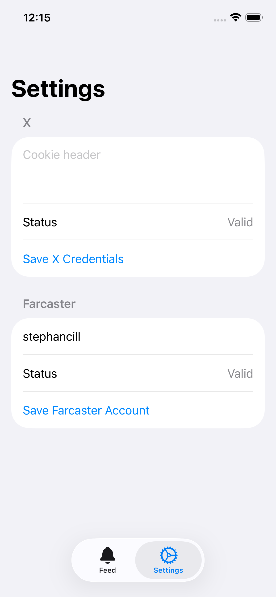
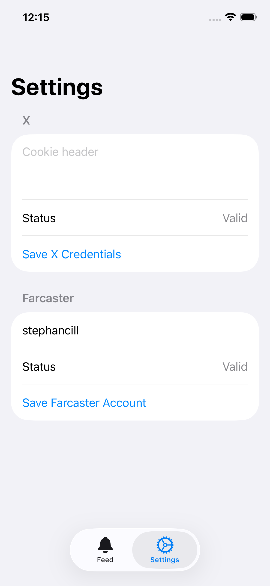

# stupid social

A notifications-only social app. See what matters without the algorithmic feed.

iOS &bull; macOS

## Screenshots

<p align="center">
  
  &nbsp;&nbsp;&nbsp;&nbsp;
  
</p>

## Features

- Combined feed for X and Farcaster notifications
- Engagement-only X filtering (mentions, replies, quotes, likes, retweets)
- Unread/read sections with compact timestamps
- Pull-to-refresh
- Liquid Glass design on iOS 26
- Runs on macOS too

## Setup

Built with [xtool](https://github.com/xtool-org/xtool).

```bash
# Run on iOS Simulator
xtool dev run --simulator

# Run on iPhone over Wi-Fi
xtool dev run --network -u <device-udid>

# Run on macOS
swift run NoFeedSocialMac
```
